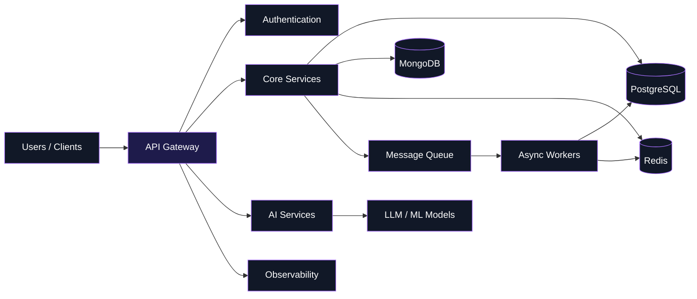

<div align="center">


<br>


<br><br>

<a href="https://github.com/Podmaraj">

</a>

<a href="https://linkedin.com/in/your-linkedin">

</a>

<br><br>


</div>

<br>

<table align="center" width="100%">
<tr>

<td width="100%" valign="top">

## About

```yaml
name:        Podmaraj Boruah
role:        Backend Engineer / Full-Stack Developer

focus:
  - Distributed Systems
  - System Design
  - Backend Architecture
  - AI Applications

engineering:
  backend:        APIs, Microservices, Event-Driven Systems
  databases:      PostgreSQL, MongoDB, Redis
  infrastructure: Docker, Kubernetes, Linux
  ai:             LLMs, Agents, RAG

philosophy:
  "Build software that solves real problems."
```

I design backend architectures that turn complex requirements into
**reliable, scalable and maintainable systems**.

My interests sit at the intersection of **backend engineering,
distributed systems, system design and AI**.

I enjoy understanding how systems behave under load, how services
communicate, where failures happen and how architecture can evolve
without becoming unnecessarily complicated.

</td>

</tr>
</table>

---

<div align="center">

## Technology

### Languages


<br><br>

### Frontend


<br><br>

### Backend


<br><br>

### Data & Infrastructure


<br><br>

### AI / ML


<br>


</div>

---

## Engineering

I think about software as a system rather than a collection of individual features.



My engineering approach is simple:

```text
Problem
   ↓
Understand
   ↓
Design
   ↓
Build
   ↓
Measure
   ↓
Scale
   ↓
Improve
```

The goal isn't simply to make software work.

It's to understand **why it works, how it fails, and how it behaves when the system grows.**

---

## Selected Work

<table width="100%">
<tr>

<td width="50%" valign="top">

### Enterprise Hospital Management

A large-scale healthcare platform designed around modular services, clinical workflows, patient records, scheduling and enterprise operations.

**Stack**

`NestJS` `Fastify` `Next.js` `PostgreSQL` `Prisma` `Redis`

</td>

<td width="50%" valign="top">

### Atlas Gateway

A high-performance API gateway written in **Go**, focused on routing, middleware, rate limiting and service communication.

**Stack**

`Go` `HTTP` `Concurrency` `Rate Limiting`

</td>

</tr>

<tr>

<td width="50%" valign="top">

### Sustainability Platform

A platform connecting environmental initiatives with measurable organizational impact through recycling, campaigns and sustainability tracking.

**Concepts**

`Recycling` `Carbon Credits` `Impact Tracking`

</td>

<td width="50%" valign="top">

### AI Applications

Building AI systems around agents, LLMs and automation with a focus on practical production workflows.

**Stack**

`LangChain` `LangGraph` `RAG` `LLMs` `AI Agents`

</td>

</tr>
</table>

---

<div align="center">

## GitHub Universe

<br>


<br><br>


  


<br><br>


<br><br>


</div>

---

## Principles

<table width="100%">
<tr>

<td width="50%" valign="top">

### Simplicity

Complexity should exist because the problem requires it — not because the technology makes it possible.

</td>

<td width="50%" valign="top">

### Reliability

Production systems must be designed with failure in mind.

</td>

</tr>

<tr>

<td width="50%" valign="top">

### Scalability

Scale around real bottlenecks rather than assumptions.

</td>

<td width="50%" valign="top">

### Impact

The best software solves a real problem for a real user.

</td>

</tr>
</table>

---

<div align="center">

## Connect

<a href="https://github.com/Podmaraj">

</a>

<a href="https://linkedin.com/in/your-linkedin">

</a>

<br><br>

<i>Build software that solves real problems.</i>

<br><br>


</div>
