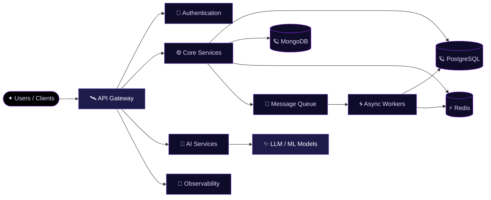

<div align="center">


<br>


<br>


<br><br>

<a href="https://github.com/Podmaraj"></a>
<a href="https://linkedin.com/in/your-linkedin"></a>

<br><br>


</div>

<br>

---

<div align="center">

## 🌌 Mission Log

</div>

```yaml
navigator:   Podmaraj Boruah
role:        Backend Engineer / Full-Stack Developer

trajectory:
  - Distributed Systems
  - System Design
  - Backend Architecture
  - AI Applications

instruments:
  backend:        APIs, Microservices, Event-Driven Systems
  databases:      PostgreSQL, MongoDB, Redis
  infrastructure: Docker, Kubernetes, Linux
  ai:             LLMs, Agents, RAG

transmission:
  "Build software that solves real problems."
```

<div align="center">

I design backend architectures that turn complex requirements into **reliable, scalable, and maintainable systems** —
the same way a star chart turns scattered points of light into something navigable.

My orbit sits at the intersection of **backend engineering, distributed systems, system design, and AI.**
I care about how services behave under load, how failures propagate, and how architecture can expand
without collapsing into its own gravity.

</div>

---

<div align="center">

## ✦ Constellation of Skills

<sub>Every star is a tool. Every cluster, a discipline.</sub>

<br><br>

**◆ Languages**


<br><br>

**◆ Frontend**


<br><br>

**◆ Backend**


<br><br>

**◆ Data & Infrastructure**


<br><br>

**◆ AI / ML**


<br>


</div>

---

<div align="center">

## 🛰️ System Orbit

<sub>How a request travels through the systems I build</sub>

</div>



<div align="center">

**Engineering trajectory**

`Problem` → `Understand` → `Design` → `Build` → `Measure` → `Scale` → `Improve`

The goal isn't just to make software work — it's to understand
**why it works, how it fails, and how it behaves as the system grows.**

</div>

---

<div align="center">

## 🪐 Charted Systems

<sub>Selected work — each one a world I've mapped and built out</sub>

</div>

<table width="100%">
<tr>

<td width="50%" valign="top">

### 🏥 Enterprise Hospital Management
A large-scale healthcare platform built around modular services — clinical workflows, patient records, scheduling, and enterprise operations.

**Stack:** `NestJS` `Fastify` `Next.js` `PostgreSQL` `Prisma` `Redis`

</td>

<td width="50%" valign="top">

### 🌀 Atlas Gateway
A high-performance API gateway written in **Go** — routing, middleware, rate limiting, and service communication at the edge.

**Stack:** `Go` `HTTP` `Concurrency` `Rate Limiting`

</td>

</tr>
<tr>

<td width="50%" valign="top">

### 🌍 Sustainability Platform
Connecting environmental initiatives to measurable organizational impact — recycling, campaigns, and sustainability tracking.

**Concepts:** `Recycling` `Carbon Credits` `Impact Tracking`

</td>

<td width="50%" valign="top">

### ✨ AI Applications
Production-grade AI systems built around agents, LLMs, and automation, focused on real, usable workflows.

**Stack:** `LangChain` `LangGraph` `RAG` `LLMs` `AI Agents`

</td>

</tr>
</table>

---

<div align="center">

## 🔭 Observatory — GitHub Universe

<br>


<br><br>


<br><br>


<br><br>


<br>

<sub>⚠️ If any card above shows blank, it's the shared render service rate-limiting, not a dead repo — refresh, or self-host the stats API on your own Vercel instance for a permanent fix.</sub>

</div>

---

<div align="center">

## 🌠 Guiding Principles

</div>

<table width="100%">
<tr>

<td width="50%" valign="top">

**◆ Simplicity**
Complexity should exist because the problem requires it — not because the technology makes it possible.

</td>

<td width="50%" valign="top">

**◆ Reliability**
Production systems are designed with failure in mind, not as an afterthought.

</td>

</tr>
<tr>

<td width="50%" valign="top">

**◆ Scalability**
Scale around real bottlenecks, measured — never around assumptions.

</td>

<td width="50%" valign="top">

**◆ Impact**
The best software solves a real problem for a real user.

</td>

</tr>
</table>

---

<div align="center">

## 📡 Signal Me

<a href="https://github.com/Podmaraj"></a>
<a href="https://linkedin.com/in/your-linkedin"></a>

<br><br>

<i>Build software that solves real problems.</i>

<br><br>


</div>
